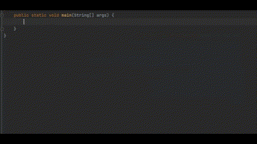
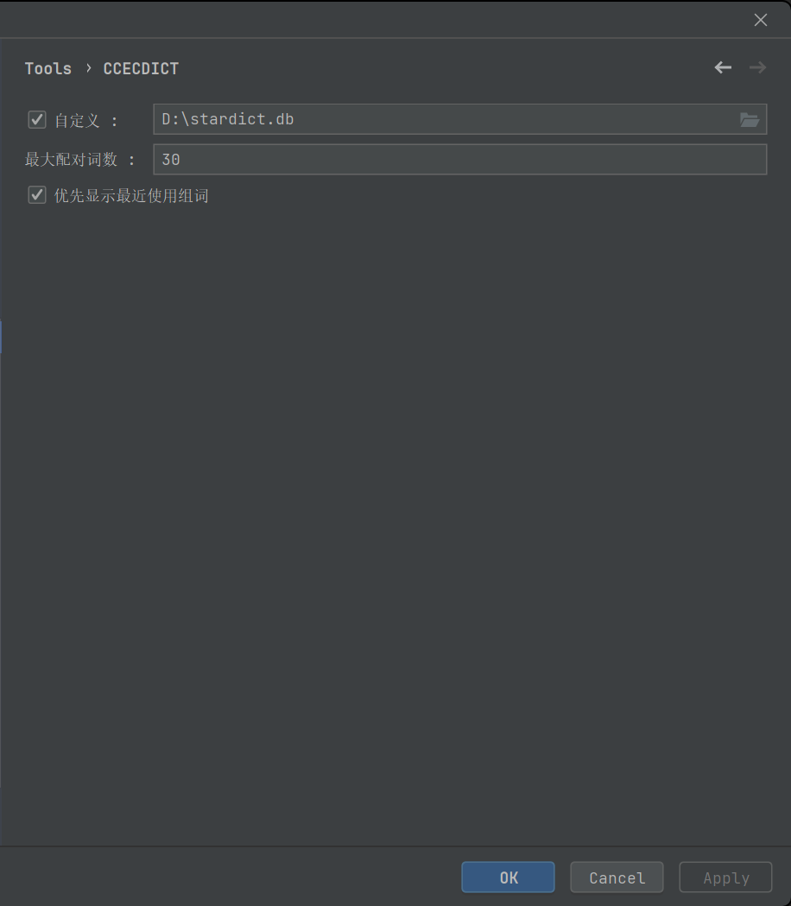

# [CCECDICT](https://github.com/PonKing66/CCECDICT)

<!-- Plugin description -->

Code completion plugin for English to Chinese Dictionary based IntelliJ  IDEA.

It is an intelligent code completion plugin that provides smart Chinese-English translation code completion functionality while writing code, correcting word spelling errors.

More tutorial please visit： [here.](https://github.com/PonKing66/CCECDICT)

## Introduction

- Support for Pycharm, Golang and Intellij Idea.
- Configure plugin. <kbd>Settings/Preferences</kbd> > <kbd>Tools</kbd> > <kbd>EEECDICT</kbd>
- The ECDICT word database is extensive, but the plugin only retains a list of the [10,000 most common English words](https://github.com/first20hours/google-10000-english). More tutorial please visit： [here.](https://github.com/PonKing66/CCECDICT)

<!-- Plugin description end -->
## Installation

- Using IDE built-in plugin system:

  <kbd>Settings/Preferences</kbd> > <kbd>Plugins</kbd> > <kbd>Marketplace</kbd> > <kbd>Search for "EEECDICT"</kbd> >

  <kbd>Install Plugin</kbd>

- Manually:

  Download the [latest release](https://github.com/PonKing66/dictionary-completion/releases/latest) and install it manually using

  <kbd>Settings/Preferences</kbd> > <kbd>Plugins</kbd> > <kbd>⚙️</kbd> > <kbd>Install plugin from disk...</kbd>

---

中英字典的双解词典代码提示插件

> ECDICT 单词库庞大，插件仅保存在[10000个最常见英语单词的列表](https://github.com/first20hours/google-10000-english)，另有需求请自行配置[自定义数据库](https://github.com/PonKing66/CCECDICT)。

配置自定义数据库，[下载 ecdict-sqlite](https://github.com/skywind3000/ECDICT/releases/download/1.0.28/ecdict-sqlite-28.zip)，配置字典库路径。

Plugin based on the [IntelliJ Platform Plugin Template][template].

[template]: https://github.com/JetBrains/intellij-platform-plugin-template
[docs:plugin-description]: https://plugins.jetbrains.com/docs/intellij/plugin-user-experience.html#plugin-description-and-presentation

## Thanks

- [ECDICT](https://github.com/skywind3000/ECDICT.git) @skywind3000